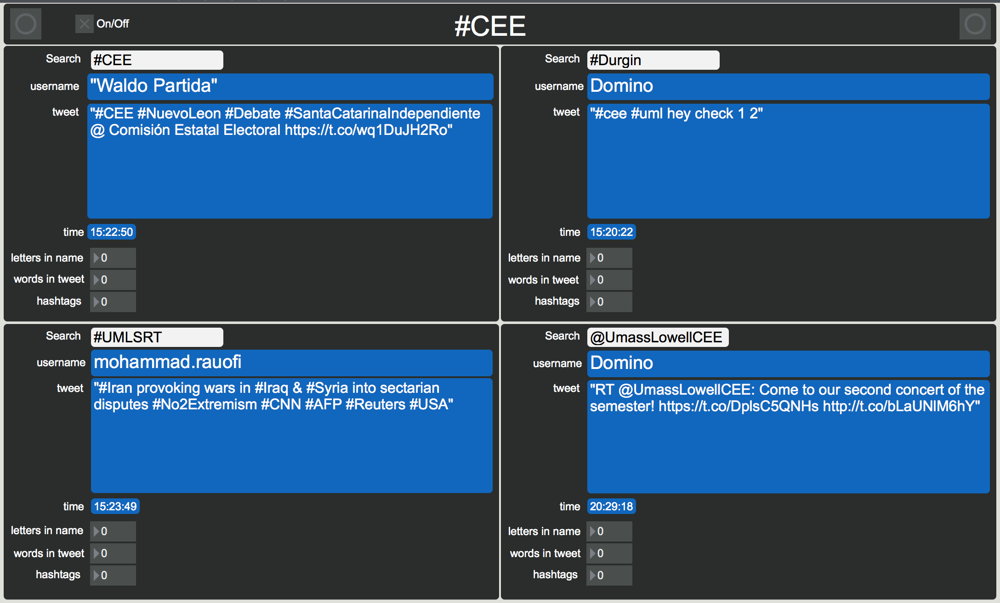

# Twitter Sonification

“#CEE” is a MaxMSP patch that searches for tweets, translates them to data,
and outputs them to non-speech audio to convey the information. This technique is
known as sonification, that is translating data sets to an audilbe form.
Using a subpatch created by [Gokce Kinayoglu](https://cycling74.com/tools/searchtweet-design-patches-that-respond-to-twitter-posts/). MaxMSP looks for a tweet
using a specific hastag, “#CEE”. The tweet is then routed to a sub patch that strips
the text and creates numerical data from it. That numerical data is then sent to
another patch that sends midi data to Ableton live to trigger loops corresponding to
the data.
